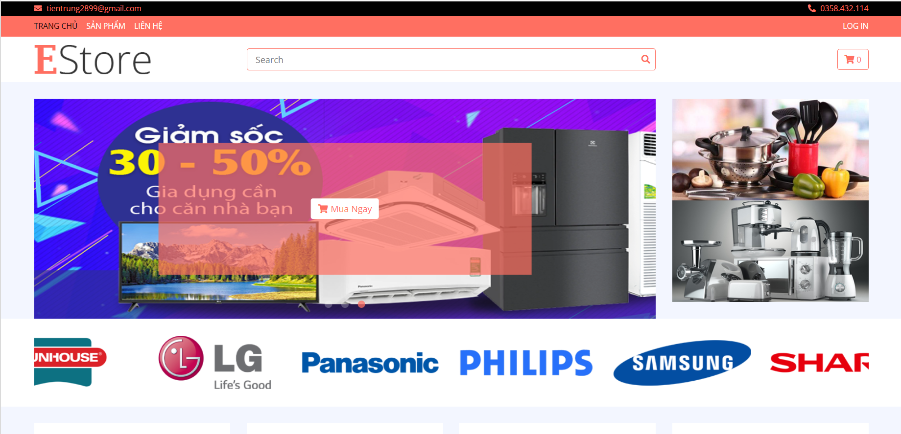
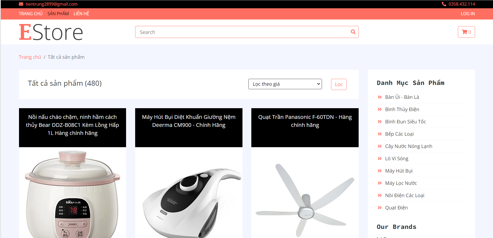
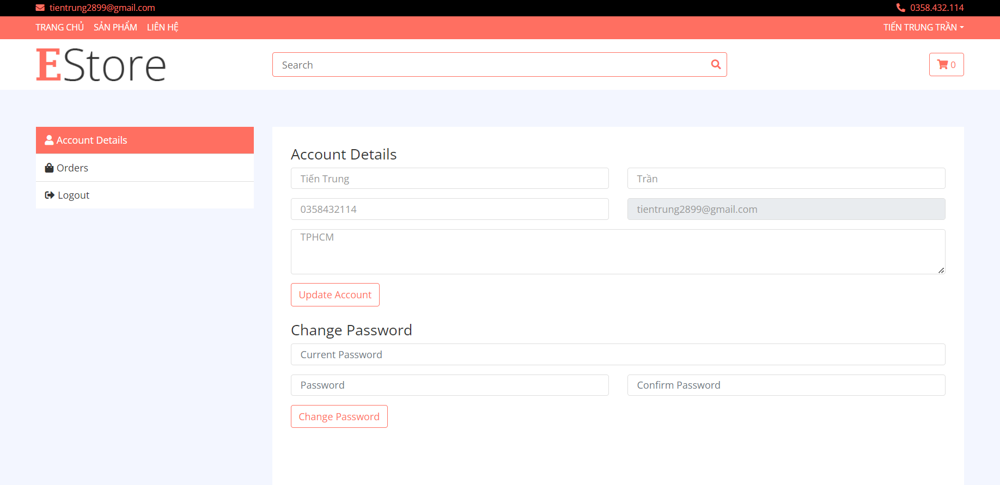
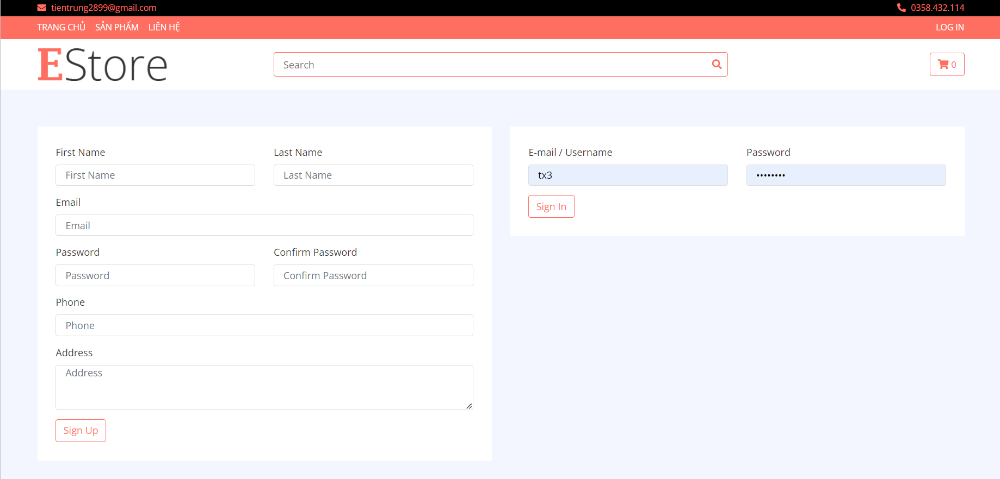

# Estore
Django practice project Ecommerce website

# Installation
* 1 - clone repo https://github.com/ttientrung/estore.git
* 2 - create a virtual environment and activate
*  - pip install virtualenv
*  - virtualenv envname
*  - envname\scripts\activate
* 3 - cd into project 
* 4 - pip install -r requirements.txt
* 5 - python manage.py runserver

# Features
* Products
* Login, Register, Logout
* Cart
* Product API

# Knowledge
* Basic Djagno Overview
* Database Design and Models
* Static Files
* User Registration & Authenticaiton
* Search
* Pagination
* Building an API with Django REST Framework (DRF)
* Deployment

# Tech Stack
* Django
* Postgres
* Django REST Framework

# Home Page
  

# Products Page
  

# Profile Page
  

# Login - Register Page
  

